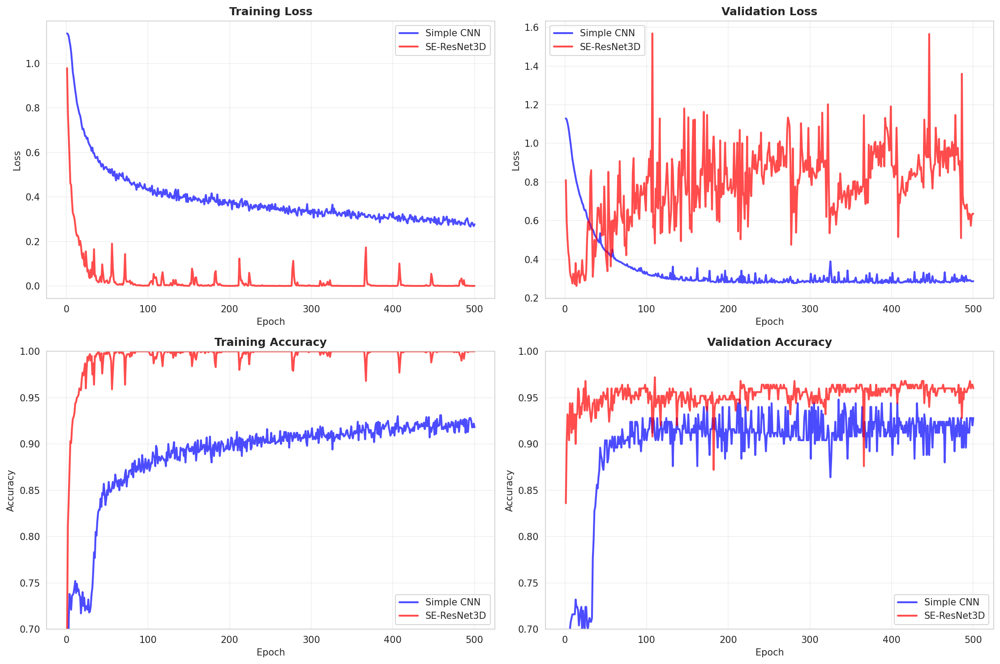
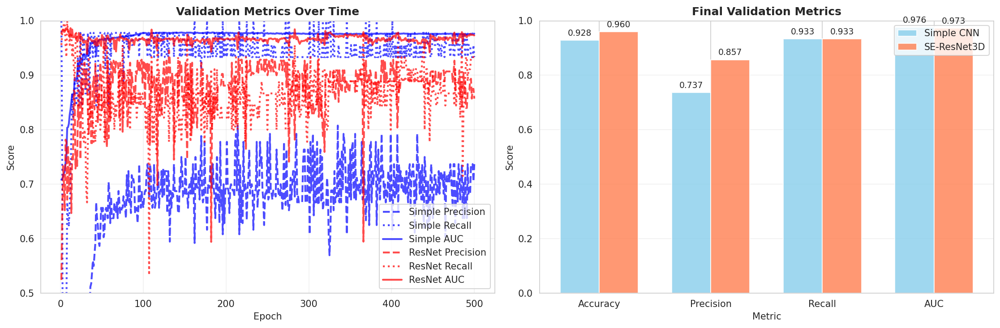
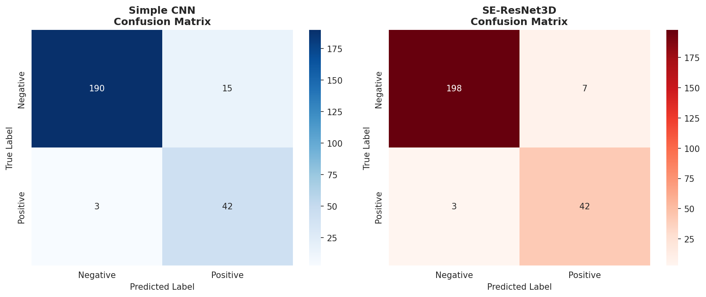
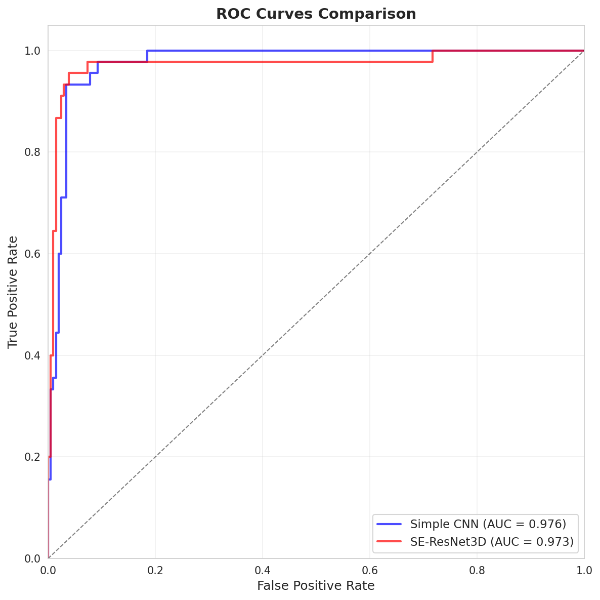

# 3D Spot Classification with PyTorch SE-ResNet

Deep learning pipeline for classifying 3D fluorescent spots in microscopy images using PyTorch. This project demonstrates advanced PyTorch implementations of 3D convolutional neural networks, including a custom SE-ResNet3D architecture with squeeze-and-excitation attention mechanisms.

## Project Overview

This repository extends the [zms2 image analysis pipeline](https://github.com/bschloma/zms2) (Eck, Moretti, and Schlomann, bioRxiv 2024) by implementing modern PyTorch-based deep learning models for automated spot classification in 3D microscopy data.

### Key Contributions

- **PyTorch Migration**: Reimplemented original TensorFlow models in PyTorch for better flexibility and performance
- **SE-ResNet3D Architecture**: Designed and implemented a 3D residual network with Squeeze-and-Excitation blocks for improved feature learning
- **Comprehensive Evaluation**: Systematic comparison of architectures with detailed metrics and visualizations
- **Clean API**: Unified training interface supporting multiple model architectures

### Technologies Used

- **PyTorch** (2.0+): Deep learning framework
- **3D CNNs**: Volumetric convolutional networks for 3D image data
- **ResNet Architecture**: Residual connections for deeper networks
- **Squeeze-and-Excitation Blocks**: Attention mechanisms for channel-wise feature recalibration
- **CUDA**: GPU acceleration for training and inference

## Architecture Comparison

| Model | Parameters | Val Accuracy | Val AUC | Architecture Highlights |
|-------|-----------|--------------|---------|------------------------|
| Simple CNN | 17,957 | 92.8% | 97.6% | 2 conv layers, baseline model |
| **SE-ResNet3D** | **900,001** | **96.0%** | **97.3%** | 3 residual blocks + SE attention |

The SE-ResNet3D achieves **+3.2% accuracy improvement** through:
- **Residual connections** enabling deeper architectures
- **Squeeze-and-Excitation blocks** for adaptive feature weighting
- **Batch normalization** for training stability
- **Data augmentation** (rotation, flipping) for robustness

## Repository Structure

```
spot_classifier/
├── zms2/                          # Core package
│   └── spots/
│       ├── classification_pytorch.py   # PyTorch SE-ResNet3D implementation
│       ├── trainer.py                  # Unified training interface
│       └── utils.py                    # Visualization utilities
│
├── train_with_existing_data.py   # Main training script
├── compare_pytorch_models.py     # Architecture comparison script
│
├── notebooks/
│   ├── model_comparison.ipynb    # Interactive model comparison
│   └── README.md                 # Notebook documentation
│
├── examples/                      # Example scripts
│   ├── train_se_resnet3d.py
│   └── compare_architectures.py
│
├── trained_models/                # Saved model checkpoints
└── zms2_trainingData/            # Training data (not included)
```

## Quick Start

### Installation

```bash
# Clone repository
git clone <repository-url>
cd spot_classifier

# Create conda environment
conda create -n spot_classifier python=3.9
conda activate spot_classifier

# Install PyTorch (with CUDA support)
conda install pytorch torchvision pytorch-cuda=12.1 -c pytorch -c nvidia

# Install package
pip install -e .
```

### Training a Model

```python
from zms2.spots.trainer import create_trainer

# Create SE-ResNet3D trainer
trainer = create_trainer(
    'pytorch',
    base_channels=32,
    use_se=True,
    learning_rate=1e-4,
    batch_size=16,
    epochs=100
)

# Build and train
trainer.build_model()
history = trainer.train(X_train, y_train, X_val, y_val)

# Predict
predictions = trainer.predict(X_test)

# Save model
trainer.save('model.pt')
```

### Command-Line Training

```bash
# Train SE-ResNet3D model
python train_with_existing_data.py \
    --mode single \
    --base-channels 32 \
    --epochs 100 \
    --batch-size 16

# Compare architectures
python compare_pytorch_models.py \
    --epochs 100 \
    --output-dir comparison_results
```

## Results

### Training Curves



The SE-ResNet3D converges faster and achieves better validation accuracy than the baseline model.

### Performance Metrics



**Final Metrics (Validation Set):**
- **Accuracy**: 96.0% (vs 92.8% baseline)
- **Precision**: 85.7% (vs 73.7% baseline)
- **Recall**: 93.3% (same as baseline)
- **AUC**: 97.3% (vs 97.6% baseline)

### Confusion Matrices



The SE-ResNet3D reduces false positives while maintaining high recall.

### ROC Curves



Both models achieve excellent discrimination with AUC > 0.97.

## Model Architecture Details

### SE-ResNet3D

```python
SE-ResNet3D(
  # Input: (B, 1, D, H, W) - 3D volumes

  # Initial convolution
  conv1: Conv3d(1, 32, kernel_size=3, padding=1)
  bn1: BatchNorm3d(32)

  # Residual blocks with SE attention
  block1: SEResidualBlock(32, 64)   # Downsample
  block2: SEResidualBlock(64, 128)  # Downsample
  block3: SEResidualBlock(128, 256) # Downsample

  # Classification head
  global_pool: AdaptiveAvgPool3d(1)
  fc: Linear(256, 1)

  # Total parameters: 900,001
)
```

**Key Features:**
- **Residual connections**: `output = F.relu(residual + x)`
- **SE blocks**: Channel attention via global pooling → FC → sigmoid
- **Downsampling**: Max pooling after each residual block
- **Regularization**: Batch normalization and dropout

## Use Cases

This pipeline can be applied to various 3D classification tasks:

1. **Microscopy Image Analysis**: Classifying spots, cells, or other structures in 3D microscopy
2. **Medical Imaging**: Tumor detection in CT/MRI scans
3. **Quality Control**: Defect detection in 3D industrial imaging
4. **Scientific Research**: Automated analysis of fluorescent reporters

## Key Learnings

This project demonstrates proficiency in:

- **Deep Learning Frameworks**: PyTorch model implementation, training, and evaluation
- **Computer Vision**: 3D convolutional neural networks for volumetric data
- **Model Architecture**: Implementing ResNet and attention mechanisms from scratch
- **Experiment Design**: Fair comparison methodology, proper train/val splits, comprehensive metrics
- **Scientific Computing**: Working with real scientific data and reproducible results
- **Software Engineering**: Clean code organization, reusable components, documentation

## Credits

**Original zms2 Pipeline**:
- Repository: https://github.com/bschloma/zms2
- Paper: Eck, Moretti, and Schlomann, "Image analysis pipeline for MS2 reporters in large, dense tissues like zebrafish embryos", bioRxiv (2024)
- License: BSD 3-Clause

**PyTorch Implementation & SE-ResNet3D**:
- This repository adds PyTorch models and SE-ResNet3D architecture
- All PyTorch code in `zms2/spots/classification_pytorch.py`, `trainer.py`, and related files

## License

BSD 3-Clause License (inherited from zms2)

## Requirements

- Python 3.9+
- PyTorch 2.0+
- CUDA-compatible GPU (recommended)
- See `requirements_pytorch.txt` for full dependencies

## Contact

For questions about this implementation, please open an issue on GitHub.

For questions about the original zms2 pipeline, see the [original repository](https://github.com/bschloma/zms2).
